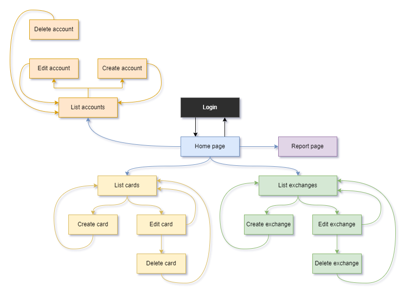
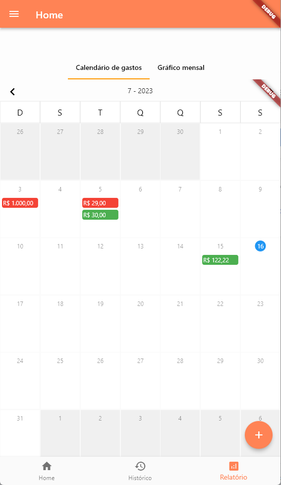

# hudson
Hudson is a project of a mobile application based on financees management.

## Context
This project should become a mobile application of financees management. The main work goal is help people to add incomes and expenses in order to organize their financial movements. This app should be available initially for Android and (maybe) Web and for free.

First things first, the app functionalities are the following:
- Register recurring incomes and expenses
- Associate expense to a future income
- Add a spent to a debit or credit card
- Organize credit purchases by monthly billings
- Calendar view pointing the exchanges of each day of the month

## Technical Notes
1. The app is being developed using Flutter framework in order to make it easy to expand to another platform.
2. The database management system is initially SQLite and the data management is embbeded on the application code.

## Page Flow
The following image presents the application flow diagram, when we can consider the black node "Login" as the starter point of the user workflow.

## Pages
The following section shows the main screenshots of the application, using some generic data to explore each page of the system.

### Login Page

### Home Page

### Account Pages

### Card Pages

### Exchange Pages

### Report Page

## Widget Tree
This section looks for present the widget trees from all the pages developed in this application. The home page show the most complex composition but the CRUD pages (i.e. list and details pages) are all similar to each others.

### Login Page

### Home Page

### Account List Page

### Account Details Page

### Card List Page

### Card Details Page

### Exchange List Page

### Exchange Details Page

### Report Page

## Refferences
1. Flutter Framework https://flutter.dev/
1. FastAPI Framework https://fastapi.tiangolo.com/
1. Postgres https://www.postgresql.org/

